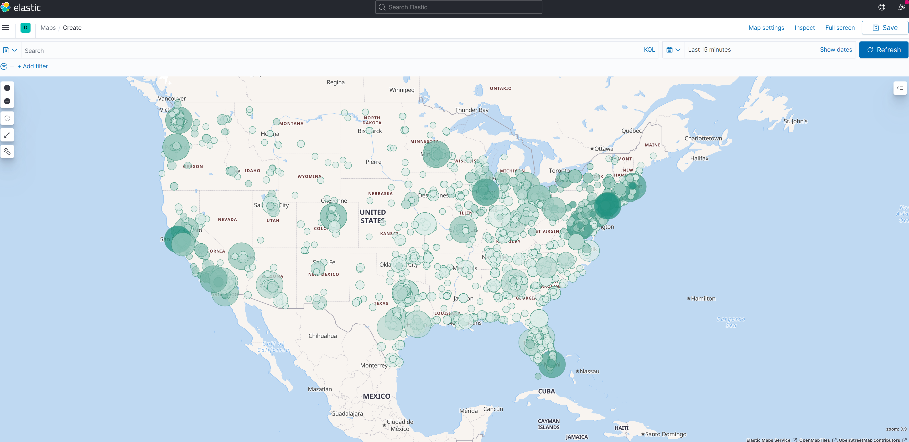

# Zillow Rent data processed and stored into Elasticsearch
## zillow-kafka-elastic
#### Kafka topics, Kafka Connect, KStreams

### Input

* Monthly rent averages by city from zillow file City_zori_sm_monthly.csv
* USCities census data from usgis is used to augment the rent data with GPS coordinates file uscities.csv

### Processing

* The rental csv file is stored in zillow-input folder. 
* The kafka connect source connector zillow-rent-csv-spooldir-01 reads the csv and publishes each row into the kafka topic zillow_rent_data_input_01
* The kafka connect source connector us-cities-csv-spooldir-01 reads the uscities.csv present in unprocessed folder publishes the cities into us_cities_input_01
* The kafka connect sink connector kafka-2-postgres-sink-02 takes the messages in us_cities_input_01 and stores them into uscities in postgres db
* The kafka stream processor reads each message from zillow_rent_data_input_01 queries the uscities table for the lat lng and other facts and returns a new augmented stream which gets pushed into topic zillow_rent_processed_out
* The kafka connect sink connector kafka-2-elasticsearch-sink-01 reads the messages present in zillow_rent_processed_out and stores it in elasticsearch

### Money Shot

